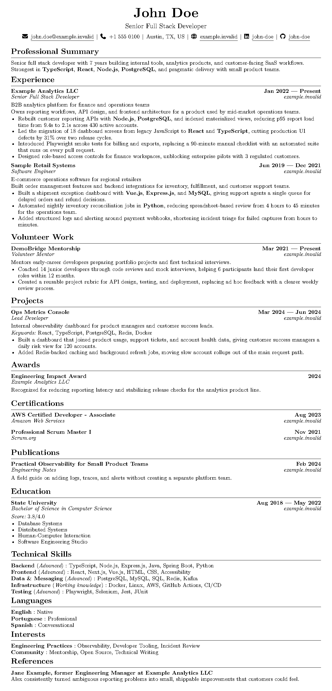

# resume-ci

> Simple resume generator built for developers.

[](LICENSE)

Maintaining a resume in Word or Google Docs means fighting content and formatting at the same time. resume-ci keeps them separate: content in YAML files versioned in Git, layout in a Typst template you never have to touch if you don't want to. A simple `make build` run gives you a clean PDF resume.

Ships with `CLAUDE.md` and `AGENTS.md` so AI agents know the schema and writing standards. Ask your favorite AI agent to rewrite a section and the PDF layout stays exactly as it should.

Content uses the [JSON Resume](https://jsonresume.org/schema) schema. A `meta` block controls rendering: template, font, locale, and section titles.



## Quick Start

To keep your resume private, create a new private repository on GitHub, then:

```bash
git clone https://github.com/gustavo-ferreira03/resume-ci.git
cd resume-ci
git remote set-url origin <your-repo-url>
git push -u origin main
make setup
cp resumes/resume-en.example.yml resumes/resume-en.yml
```

To keep it public, fork this repository on GitHub, clone your fork, then:

```bash
make setup
cp resumes/resume-en.example.yml resumes/resume-en.yml
```

In both cases, edit `resumes/resume-en.yml` with your information, then:

```bash
make build
```

PDFs are written to `build/`. Push to `main` and GitHub Actions builds them automatically, attaching the PDFs to a GitHub Release.

To pull tooling and template updates from this repository into your repo later, commit or stash your changes and run:

```bash
make sync
```

Merges upstream changes. Your resumes are never touched. If a conflict requires manual resolution, sync stops and lists the files before running:

```bash
git merge --continue
```

## Requirements

`make setup` downloads Bun, Typst, and Font Awesome fonts into `lib/bin/` and installs dependencies.

Install these system packages first:

**macOS:**

```bash
brew install curl jq
```

**Ubuntu / Debian:**

```bash
sudo apt install curl jq tar unzip
```

## Commands

| Command | Description |
|---|---|
| `make setup` | Install local tooling |
| `make sync` | Merge upstream changes into your repo |
| `make schema` | Regenerate `lib/schema.json` for editor autocomplete |
| `make build` | Build every resume in `resumes/` |
| `make build ARGS="resumes/resume-en.yml"` | Build one resume |
| `make watch` | Watch all resumes and templates |
| `bun lib/src/resume-ci.ts --watch resumes/resume-en.yml` | Watch one resume |
| `bun lib/src/resume-ci.ts --output-dir dist` | Use a custom output directory |

## YAML Structure

Copy an example and edit it:

```bash
cp resumes/resume-en.example.yml resumes/resume-en.yml
```

Smallest useful shape:

```yaml
# yaml-language-server: $schema=../lib/schema.json

meta:
  template: default
  font: New Computer Modern
  output_filename: resume_john_doe_en
  section_titles:
    work: Experience
    projects: Projects
    education: Education
    skills: Technical Skills

basics:
  name: John Doe
  label: Full Stack Developer
  email: john.doe@example.invalid
  summary: Short profile text.
  profiles:
    - network: LinkedIn
      url: https://linkedin.example.invalid/in/john-doe
    - network: GitHub
      url: https://git.example.invalid/john-doe

work:
  - name: Example Corp
    position: Full Stack Developer
    startDate: 2022-01
    endDate: 2024-06
    url: https://company.example.invalid
    highlights:
      - Built **REST APIs** with **Node.js** and **PostgreSQL**.

projects: []
certificates: []
education: []
skills: []
languages: []
```

Use `[]` to hide a list-backed section. For current roles, omit `endDate`; the PDF will show `Present`.

> Writing the resume content? [`AGENTS.md`](AGENTS.md) covers strong, honest bullets: STAR structure, evidence standards, and AI-writing tells to avoid.

## JSON Resume Compatibility

The YAML uses JSON Resume field names:

| JSON Resume field | Rendered as |
|---|---|
| `basics.name` | Header name |
| `basics.label` | Header title |
| `basics.email`, `phone`, `url`, `location`, `profiles` | Contact row |
| `basics.summary` | Summary section |
| `work` | Experience section |
| `work[].name` | Company |
| `work[].position` | Role |
| `work[].highlights` | Bullets |
| `volunteer` | Volunteer section |
| `projects` | Projects section |
| `projects[].name` | Project name |
| `projects[].roles` | Project role line |
| `projects[].highlights` | Bullets |
| `awards` | Awards section |
| `certificates` | Certifications section |
| `publications` | Publications section |
| `education` | Education section |
| `skills[].name` | Skill group label |
| `skills[].keywords` | Skill list |
| `languages` | Languages section |
| `interests` | Interests section |
| `references` | References section |

Dates must use JSON Resume's ISO-style format: `YYYY`, `YYYY-MM`, or `YYYY-MM-DD` for `startDate`, `endDate`, `date`, and similar fields.

Extra JSON Resume fields pass validation, but the default template only renders fields it knows about.

## Editor Autocomplete

Add this to the top of any resume file for autocomplete and inline validation (VS Code, Neovim, any editor with a YAML language server):

```yaml
# yaml-language-server: $schema=../lib/schema.json
```

`lib/schema.json` is generated from `lib/src/schema.ts`. Do not edit it by hand. If you change the Zod schema, run:

```bash
make schema
```

## `meta` Extension

`meta` extends JSON Resume's own `meta` object with build and presentation settings.

| Field | Required | Notes |
|---|---|---|
| `meta.template` | no | Template name without `.typ`; defaults to `default` |
| `meta.font` | no | Typst font family name; defaults to `New Computer Modern` |
| `meta.output_filename` | no | PDF file name without `.pdf`; generated from `basics.name` if omitted |
| `meta.locale` | no | BCP 47 locale for date formatting (e.g. `en`, `pt-BR`, `es`); defaults to `en` |
| `meta.present_label` | no | Label for ongoing roles with no `endDate`; derived from `locale` if omitted (`Present`, `Atual`, `Actualidad`) |
| `meta.section_titles` | no | Custom section labels |
| `meta.canonical`, `meta.version`, `meta.lastModified` | no | JSON Resume metadata fields |

`meta.locale` formats dates across the PDF — `2024-09` renders as `Sep 2024` in `en` and `Set 2024` in `pt-BR` — and sets the default open-role label (`Present`, `Atual`, `Actualidad`). Use `meta.present_label` to override it.

```yaml
meta:
  locale: pt-BR          # Sep 2024 → Set 2024, omitted endDate → Atual
  present_label: Atual   # explicit override (optional when locale is set)
```

Section title keys use JSON Resume section names:

```yaml
meta:
  section_titles:
    summary: Professional Summary
    work: Experience
    projects: Projects
    certificates: Certifications
    education: Education
    skills: Technical Skills
```

## Bullet Formatting

Bullets and text fields support two Markdown-style markers:

| Syntax | Output |
|---|---|
| `**text**` | bold |
| `_text_` | italic |

## Templates

Templates are single Typst files in `templates/`. Pick one in YAML:

```yaml
meta:
  template: my-template  # resolves to templates/my-template.typ
```

`meta.font` must be a Typst font family name.

## GitHub Actions

The workflow triggers on pushes to `main` when resume, template, or builder files change. Releases are tagged `build-<run_number>`.
